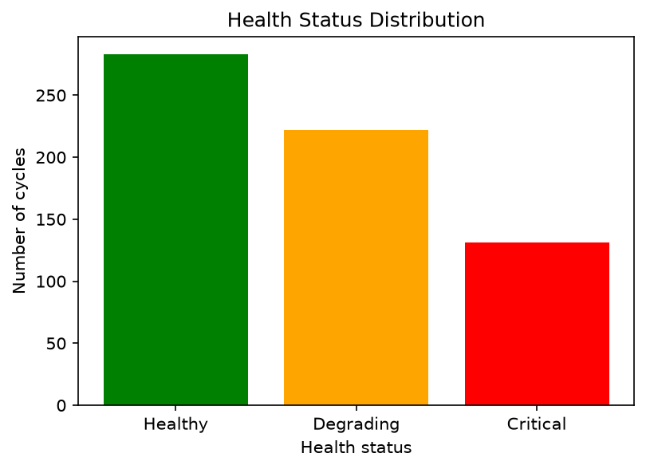
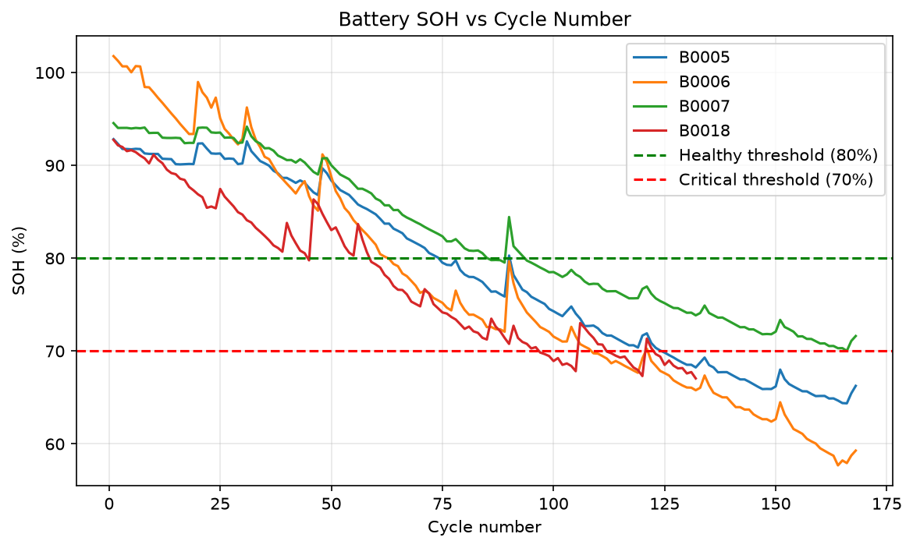
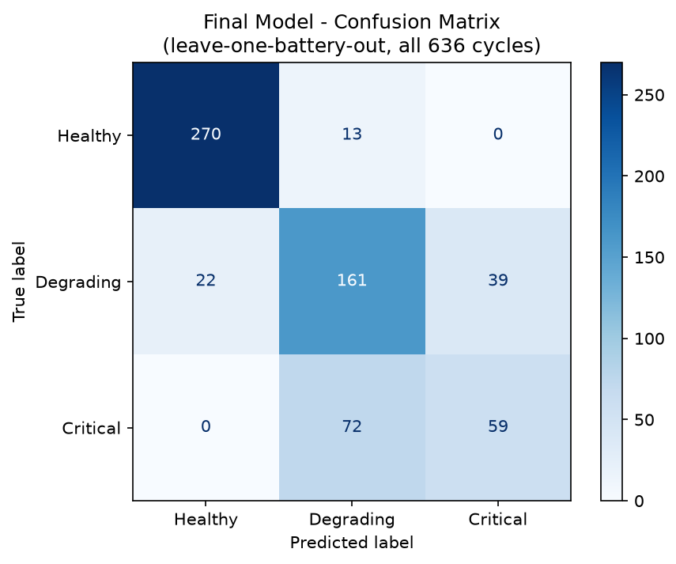
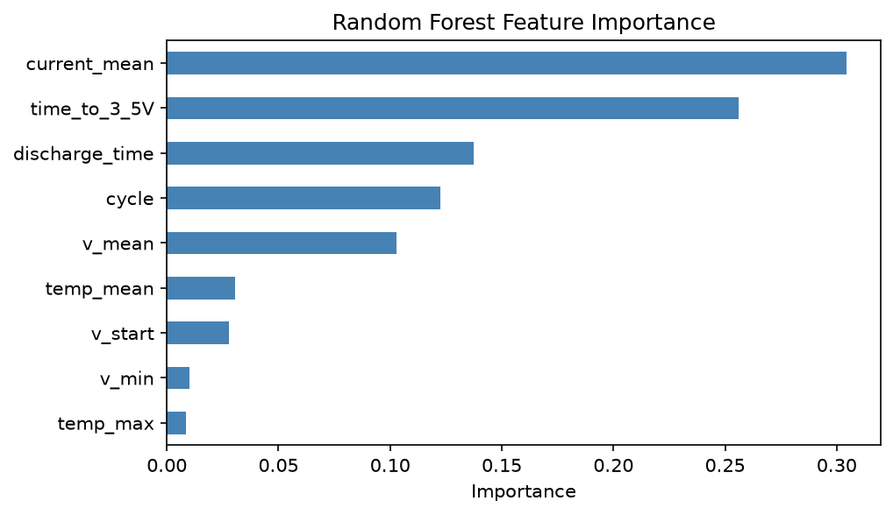

# ⚡ EV Battery Health Predictor

A machine learning project that classifies the health of an electric-vehicle Li-ion battery as **Healthy**, **Degrading** or **Critical** using the NASA Li-ion battery dataset.

  

## 📌 Overview
Battery degradation affects the safety, range and resale value of EVs. This project derives **State of Health (SoH)** from discharge capacity and trains a **Random Forest classifier** on features engineered from discharge curves, then tests it on batteries the model has never seen.

## ✨ Highlights
- Uses NASA Li-ion battery data: **4 batteries, 636 discharge cycles**
- SoH derived from discharge capacity and mapped to 3 health classes
- Features engineered from discharge curves: time to voltage thresholds and temperature
- **Leakage prevention:** inputs such as cycle number removed so predictions rely on real battery behaviour
- **Leave-one-battery-out validation** on unseen batteries
- Showed that a **random split overestimates accuracy** compared with battery-wise testing
- Final model saved with `joblib`

## 🧰 Tech Stack
Python · Pandas · NumPy · Matplotlib · Scikit-learn · Joblib

## 📂 Project Structure
```
ev-battery-health-predictor/
├── dataset/
│   └── cleaned_dataset/        # metadata.csv and cycle data files
├── outputs/                    # charts and saved model
├── ev_battery_healt_predictor.py   # main script
├── requirements.txt
├── .gitignore
└── README.md
```

## 🔬 Methodology
1. **Data preparation:** load `metadata.csv`, summarise each discharge cycle and compute SoH from capacity.
2. 2. **Labelling:** Healthy (SoH ≥ 80%), Degrading (70–80%), Critical (< 70%).
3. **Feature engineering:** time to voltage thresholds and temperature features.
4. **Leakage control:** drop cycle number and similar age-revealing inputs.
5. **Modelling:** Random Forest classifier.
6. **Validation:** leave-one-battery-out, compared with a random split.
7. **Evaluation:** accuracy, classification report and confusion matrix.

## 🚀 Getting Started
```bash
git clone https://github.com/sayandipnandi-2/ev-battery-health-predictor.git
cd ev-battery-health-predictor
pip install -r requirements.txt
python ev_battery_healt_predictor.py
```
## 📊 Results

### Data
636 discharge cycles from 4 batteries (B0005, B0006, B0007, B0018): 283 Healthy, 222 Degrading and 131 Critical.





### Model comparison
| Feature set | Accuracy | Evaluation |
|---|---|---|
| Original (incl. cycle, current, full discharge) | 84.5% | Leave-one-battery-out |
| **Refined (partial-curve), final model** | **76.4%** | Leave-one-battery-out |
| Baseline-normalised | 72.5% | Leave-one-battery-out |
| Random 80/20 split | 97.7% | Random split (optimistic) |

The random split looks far better (97.7%) because cycles from the same battery appear in both training and test sets. Testing on a completely unseen battery gives the realistic figure. The original feature set included cycle number, current and full-discharge features, while the final model uses partial-curve features (time to voltage thresholds, start voltage and temperature), giving a more realistic estimate at lower accuracy.

### Final model: confusion matrix (leave-one-battery-out, all 636 cycles)


- **Healthy:** 270 of 283 cycles correct (about 95%).
- **Degrading:** 161 of 222 correct (about 73%).
- **Critical:** 59 of 131 correct (about 45%); most misses are predicted as Degrading.
- Healthy cycles are never predicted as Critical, so errors stay between neighbouring classes.

### Feature importance (original feature set)


### Limitations
- Only four batteries, so results may not generalise to other cells.
- The Critical class is the hardest to detect, which matters most for safety.


## 🔭 Future Work
- Test on more batteries and chemistries
- Predict Remaining Useful Life (RUL)
- Build a simple monitoring dashboard

## 📚 Data Source
NASA Prognostics Center of Excellence, *Li-ion Battery Data Set* (B. Saha and K. Goebel, 2007).

## 👤 Author
**Sayandip Nandi** — B.Tech ECE, Institute of Engineering and Management, Kolkata
[LinkedIn](https://www.linkedin.com/in/sayandip2004/) · [GitHub](https://github.com/sayandipnandi-2) · sayandipnandi0@gmail.com
